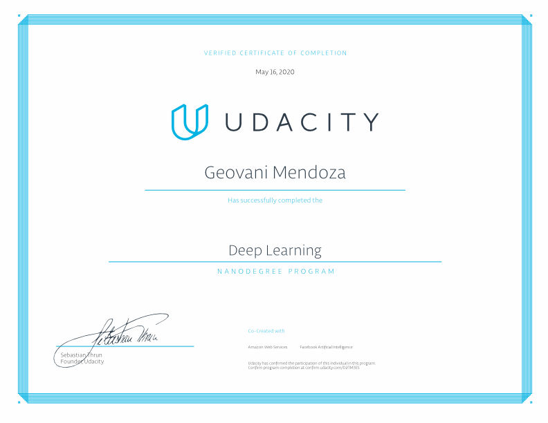

# Deep Learning (PyTorch) Nanodegree Program

This repository contains material related to Udacity's Deep Learning Nanodegree program.

There are also notebooks used as projects for the Nanodegree program. Find the projects in the ```projects/``` folder. In the other folders, you'll be able to find jupyter notebooks containing the labs used in this program.

## Table of Contents

[1. Introduction to Deep Learning](#introdl)

[](#)

[](#)

[](#)

[](#)

[](#)

[](#)

[](#)

[](#)


<a name="introdl"/>

### 1. Introduction to Deep Learning

Install Anaconda.

Deep Learning Applications.

Jupyter Notebooks.

Matrix Math and NumPy Refresher.

<a name="introdl"/>

### 


<a name="introdl"/>

### 


<a name="introdl"/>

### 


<a name="introdl"/>

### 


<a name="introdl"/>

### 


<a name="run"/>

## Run
In a terminal or command window, navigate to the top-level project directory `deep-learning-with-pytorch/` (that contains this README) and run the following command:

```bash
jupyter notebook your_jupyter_notebook.ipynb
```

or
```bash
jupyter notebook your_jupyter_notebook.ipynb
```

on any Jupyter Notebook.
This will open the iPython Notebook software and project file in your browser.


<a name="pcertificate"/>

## Program Certificate



Verify [here](https://confirm.udacity.com/D2TM3ES)


<a name="license"/>

## License
This project uses the [MIT](https://choosealicense.com/licenses/mit/) License.