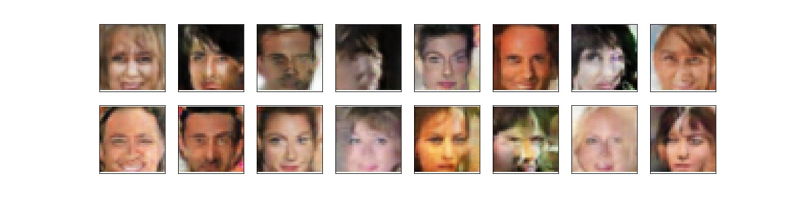
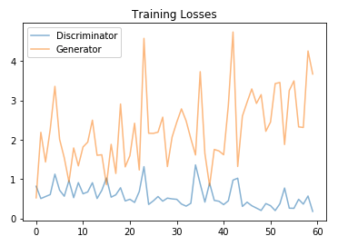

# Generate Faces

Face Generation
Introduction
In this project, you'll use generative adversarial networks to generate new images of faces.


Processed CelebA face data.

## Installation
This project requires **Python 3.6.0** and the following Python libraries installed:
- [NumPy](http://www.numpy.org/)
- [PyTorch](https://pytorch.org/)

## Run
In a terminal or command window, navigate to the top-level project directory `Generate-Faces/` (that contains this README) and run the following command:

```bash
jupyter notebook dlnd_face_generation.ipynb
```

or
```bash
jupyter notebook dlnd_face_generation.ipynb.ipynb
```

on any Jupyter Notebook.
This will open the iPython Notebook software and project file in your browser.

## Results

Generated faces after 30 epochs.



### Train Loss
Train Loss for 30 epochs.



## License
This project uses the [MIT](https://choosealicense.com/licenses/mit/) License.